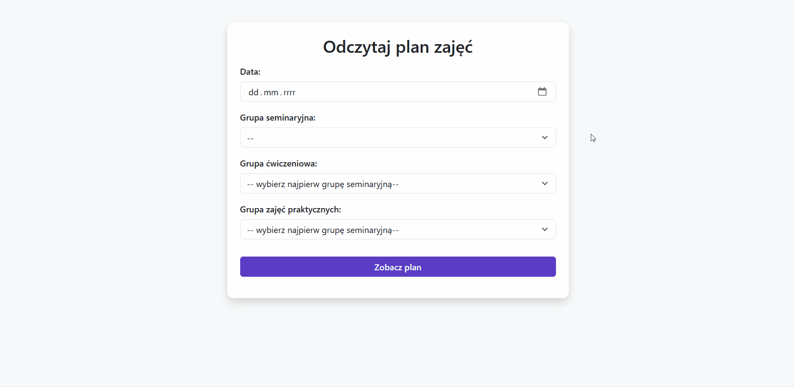
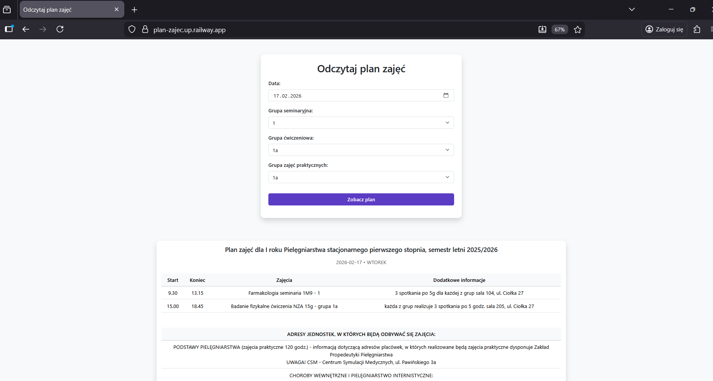
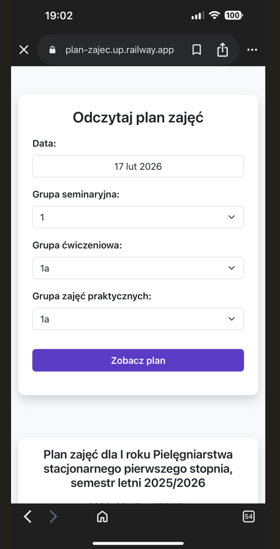
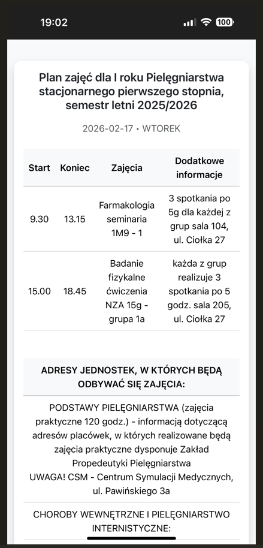

**Live Demo:** https://plan-zajec.up.railway.app/

Class Schedule Viewer is a web application that extraxts daily class schedules from complex spreadsheets.

It allows users to simply select a date and their groups to instantly view their schedule for that day.


## The problem

The schedule is published as a single, large and irregular spreadsheet.

In the original files:
- there are **17 seminar groups**, which are futher divided into 
**subgroups (a, b, c)**,
- the schedule is **not weekly and repetitive** – classes depend on the **specific calendar date**, so each week can look completely different,
- groups and subgroups appear in **multiple non-standard formats**
- dates and date ranges are written in an **inconsistent and chaotic way**,
- the size and densityof the spreadsheet also make it difficult to to clearly match classes with their corresponding start and end times.

Because of this structure, students often need to manually scan a spreadsheet to determine their schedule for a specific day and group — which makes it easy to overlook classes by mistake.


## The solution

A user-friendly web UI where a student:
1. picks a date,
2. chooses their seminer, exercise and practice group,
3. gets a clean, per-day schedule (time, class, location).

Schedule data is preprocessed from the original Excel spreadsheets and stored as CSV files for faster access.  
When a user submits the form, the backend loads the processed data, extracts the classes matching the selected date and groups, and returns the result as JSON.
The frontend then renders the schedule as a clear table.


### Demo


### Desktop view


### Mobile view
<p align="center">
  
  
</p>


## Features

- Quickly get a **daily class schedule** for a selected date and groups
- Supports **winter and summer semester** schedules
- Flexibly **parses date** for inconsistent  formats (single dates, multiple dates per cell, ranges and exceptions)
- Preprocessed schedule data (**Excel → CSV**) for **~90× faster** request handling
- **Mobile-friendly** UI (Bootstrap)


## Tech Stack

- Backend: Python, Flask, Pandas, openpyxl
- Frontend: HTML, JavaScript, Bootstrap
- WSGI: Gunicorn
- Deployment: Railway


## Architecture

Preprocessing (one-time / on update):
- `scripts/preprocess_schedule.py` reads original `.xlsx` files, normalizes merged cells, extracts relevant tables and saves lightweight `.csv` files. 

### Runtime request flow
<div align="center">
<b>User:</b> submits the form (date + groups)

↓

<b>Frontend:</b> sends request to the API (GET /api/schedule)

↓

<b>Backend:</b> handles API request
• validates parameters
• loads preprocessed CSV (winter/summer based on date)
• finds the column-range for the selected weekday
• matches the requested date
• filters classes for the selected groups
• formats times and class entries
• returns JSON

↓

<b>Frontend:</b> builds and displays class times and classroom tables
</div>

### Key modules

- `scripts/preprocess_schedule.py` — data preprocessing: `.xlsx` → normalized `.csv`
- `src/reader/schedule_reader.py` — loads class schedule from the spreadsheet and handles merged cells
- `src/reader/classrooms_reader.py` — loads classroom schedule from the spreadsheet 
- `src/app.py` — API endpoints and request parameter validation
- `src/schedule/service.py` — detects semester, coordinates loading and processing of the schedule using other modules
- `src/schedule/matcher.py` — matches spreadsheet columns to the requested date (supports different date-cell formats)
- `src/schedule/builder.py` — builds schedule for selected groups from matched columns


## API

- **GET /** - returns the main UI (HTML)
- **GET /api/schedule** - returns schedule for given parameters

### Request parameters

* selected_date - YYYY-MM-DD (e.g. 2025-11-05)
* group_seminaria - integer 1-17 (e.g. 3)
* group_cwiczenia - string for the subgroup a or b (e.g. 3a)
* group_zajecia - string for the subgroup a-c (e.g. 3b)

### Response (JSON) - example
```
{
  "schedule_name": "I rok studia stacjonarne I stopnia, kierunek Pielęgniarstwo, r.ak. 2025/2026",
  "selected_date": "2025-11-03",
  "weekday": "PONIEDZIAŁEK",
  "schedule": [
    {
      "name": "Język angielski - grupa 1",
      "start": "11.30",
      "end": "13.00",
      "info": "15 spotkań po 2 godz."
    }
  ],
  "classroom_schedule": [
    "ADRESY JEDNOSTEK, W KTÓRYCH BĘDĄ ODBYWAĆ SIĘ ZAJĘCIA...",
    "Podstawy pielęgniarstwa (ćwiczenia) - Zakład Propedeutyki Pielęgniarstwa...",
    "Socjologia (seminaria) - Studium Komunikacji Medycznej..."
  ]
}
```

## Performance Optimization

Originally the application parsed `.xlsx` spreadsheets on every request.

Since Excel parsing with `pandas` and `openpyxl` is relatively slow, this significantly increased response time.

To improve performance, a preprocessing step was introduced.

### Preprocessing

1. The original `.xlsx` spreadsheets are processed by a script
2. The relevant schedule data is extracted and merged cells are normalized.
3. The processed data is saved as lightweight `.csv` files
4. During runtime the application loads the preprocessed CSV data instead of parsing Excel files

### Result

This change reduced the average request response time by approximately **90×**.


## Run locally

Clone the repository:
```bash
git clone https://github.com/nataliabpw/class-schedule-viewer.git
cd class-schedule-viewer
```

Create a virtual environment and install dependencies:
```bash
python -m venv .venv
source .venv/bin/activate   # Linux / macOS
# .venv\Scripts\activate    # Windows

pip install -r requirements.txt
```

Run the preprocessing script (once):
```bash
python scripts/preprocess_schedule.py
```

Start the application:
```bash
flask --app src.app run
```

The application will be available at:
```bash
http://127.0.0.1:5000
```

## Data 

The example spreadsheet is based on the publicly available class schedule of the Medical University of Warsaw and is used for demonstration purposes only.

This project is unofficial and is not affiliated with or endorsed by the Medical University of Warsaw.


## License

This repository is shared publicly for portfolio and educational purposes.
The code is not licensed for reuse or redistribution.


## Future improvements

- Support schedules for additional study years
- Improve the GUI and overall user experience
- Make the schedule matching logic adaptable to other spreadsheet formats

